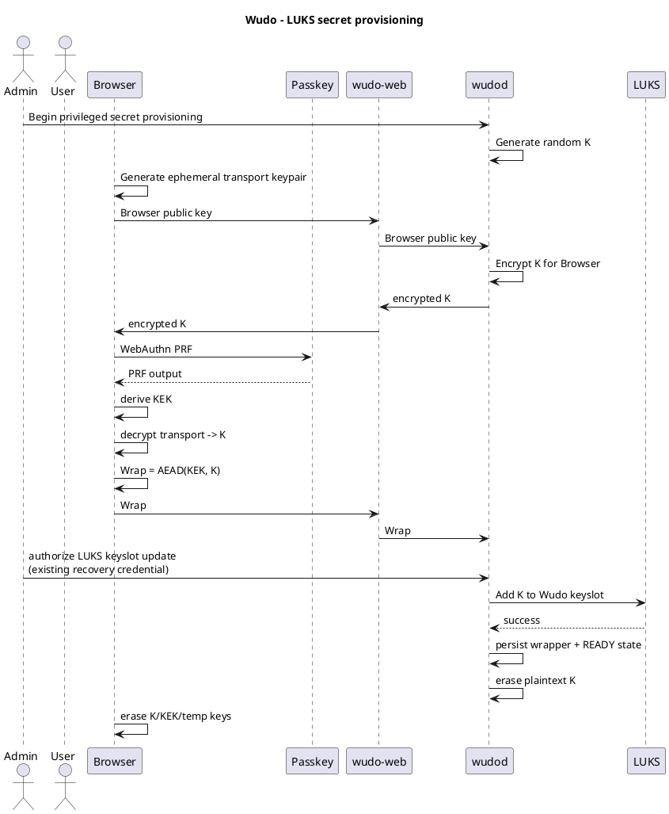

# LUKS Reference Flow

## Objective

Unlock LUKS after reboot using a passkey while retaining the existing human passphrase as recovery.

## Key layout

```text
LUKS2
├── existing slot: human recovery passphrase
└── Wudo slot: random key K
```

Wudo persistent state:

```text
paperless-luks
├── credential A -> encrypted wrapper of K
└── credential B -> encrypted wrapper of K
```

## Provisioning

Preconditions:
- action/secret definitions exist;
- at least one user exists;
- the user is authorized for the relevant action;
- an eligible PRF-capable credential is enrolled;
- local administrator can supply/authorize with the existing LUKS credential.

Conceptual sequence:



These transport arrows are conceptual, not a specified cryptographic protocol. Both directions require authenticated encryption and endpoint/ceremony binding. The exact ordering/transaction protocol requires refinement so a crash cannot leave an unknown or unrecoverable state. Malicious UI delivery is an accepted risk, as described in `SECURITY.md`.

## Normal unlock

```plantuml
@startuml
title Wudo - Normal LUKS unlock

actor User
participant Browser
participant Passkey
participant "wudo-web" as Web
participant "wudod" as Agent
participant LUKS

User -> Browser: request paperless.start

Browser -> Web: request wrapper/auth challenge
Web -> Agent: request required data
Agent -> Agent: create single-use challenge bound to action
Agent --> Web: challenge + wrapper + agent transport public data
Web --> Browser: challenge + wrapper + agent transport public data

Browser -> Passkey: WebAuthn authentication + PRF
Passkey --> Browser: authentication result + PRF output

Browser -> Browser: derive KEK
Browser -> Browser: unwrap K
Browser -> Browser: encrypt K for wudod

Browser -> Web: assertion + encrypted K + action request
Web -> Agent: relay

note over Web
wudo-web must never see plaintext K.
end note

Agent -> Agent: verify assertion, challenge binding/freshness,
credential status and user authorization; reject on failure
Agent -> Agent: consume challenge per specified replay protocol
Agent -> Agent: authenticate/decrypt transport -> K
Agent -> LUKS: unlock using K via safe input channel
LUKS --> Agent: unlocked
Agent -> Agent: erase K
Agent -> Agent: execute configured paperless.start
@enduml
```

## Paperless reference action

The intended host flow is equivalent to:

```text
cryptsetup open /dev/sda paperless_crypt
mount /srv/paperless
start Syncthing
start Docker
docker compose up -d
```

Wudo should not accept those commands from the browser. They are administrator-defined implementation details of the fixed `paperless.start` action.

Stopping/locking is a separate action and does not necessarily require the secret.
